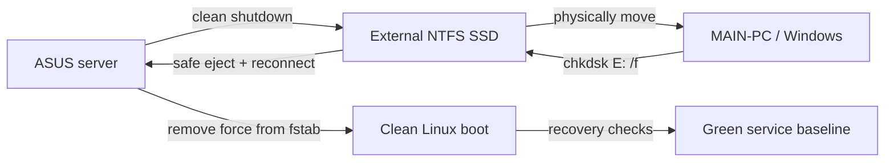

# Home Lab ASUS External SSD Recovery

Operational case study for safely repairing a dirty NTFS external SSD used by an Ubuntu-based ASUS home-lab server, then validating that the server could boot and mount the disk without a temporary Linux `force` mount option.

## Summary

The ASUS server previously depended on an external NTFS SSD mounted at `/mnt/externalssd`, with an Immich bind mount under `/DATA/Gallery/immich`. After a power-loss event, Linux restored service with `ntfsfix`, but the disk still needed a proper Windows `chkdsk` repair. To avoid repeat emergency-boot risk, the server had temporarily used `force,nofail,x-systemd.device-timeout=10` in `/etc/fstab`.

On `2026-05-27`, the disk was repaired with Windows `chkdsk E: /f`, returned to ASUS, and validated after removing the temporary `force` mount option.

Final outcome:

- Windows repaired NTFS metadata and volume bitmap issues.
- `chkdsk` reported `0 KB in bad sectors`.
- `chkdsk` reported `No further action is required`.
- ASUS booted successfully after `force` was removed.
- The SSD and Immich bind mount mounted without `force`.
- The current boot log showed no NTFS dirty/MFT warnings.
- ASUS service recovery checks passed.
- Final lab health was green: backups OK, restore states OK, failed units none, endpoint failures zero.

## Environment

| Component | Role |
| --- | --- |
| `dallas-MacMint` | Controller workstation used to run health checks and SSH orchestration |
| `asus-server` | Ubuntu-based server hosting Docker services and the external SSD |
| `MAIN-PC` | Windows workstation used to run `chkdsk` |
| External SSD | NTFS volume used for ASUS backup/service data |

Key mount paths:

- `/mnt/externalssd`
- `/DATA/Gallery/immich`

## Safe Repair Workflow

The repair was intentionally sequenced to avoid data loss:

1. Confirm the lab baseline was healthy before touching storage.
2. Cleanly shut down ASUS.
3. Move the external SSD to Windows.
4. Confirm Windows identified the disk as NTFS and `Scan Needed`.
5. Run `chkdsk E: /f`.
6. Safely eject the disk from Windows.
7. Reconnect the disk to ASUS.
8. Boot ASUS and validate service recovery.
9. Remove the temporary Linux `force` mount option.
10. Reboot ASUS again and validate a clean mount without `force`.

See [docs/recovery-runbook.md](docs/recovery-runbook.md) for the exact command flow.

## Validation Results

The final validation showed:

```text
Backup state: OK
Weekly restore state: OK
Quarterly restore state: OK
Failed units: none / none / none
Endpoint failures: 0
```

ASUS service recovery also passed:

```text
Docker active
No failed systemd units
ASUS containers healthy
Homepage, Kuma, CasaOS, NPM, Portainer, Duplicati, Immich, and Syncthing HTTPS checks passed
```

The final mount state no longer included `force`:

```text
/mnt/externalssd /dev/sdb2 ntfs3 rw,noatime,uid=1000,gid=1000,dmask=0022,fmask=0133,iocharset=utf8
/DATA/Gallery/immich /dev/sdb2[/immich] ntfs3 rw,noatime,uid=1000,gid=1000,dmask=0022,fmask=0133,iocharset=utf8
```

## Diagram



## Repository Contents

- [docs/recovery-runbook.md](docs/recovery-runbook.md) - step-by-step operational runbook
- [docs/validation-evidence.md](docs/validation-evidence.md) - key outputs and success criteria
- [docs/lessons-learned.md](docs/lessons-learned.md) - operational notes and follow-up improvements

## Notes

This repo intentionally avoids credentials, screenshots, and private configuration dumps. Hostnames and private RFC1918 addresses are included only where they explain the operational flow.
